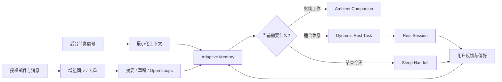
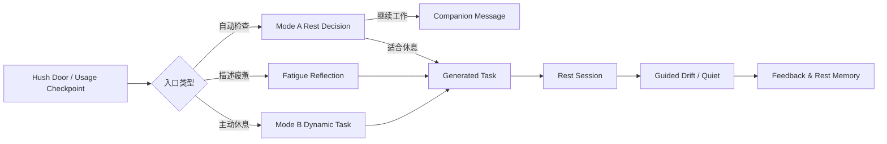
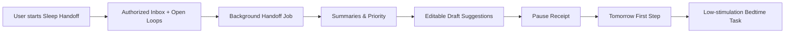
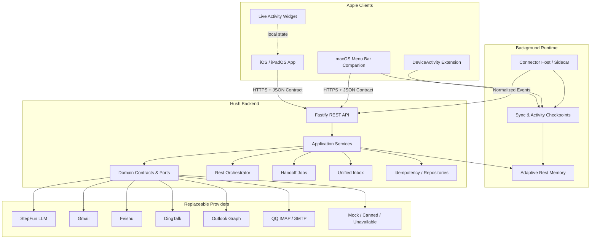
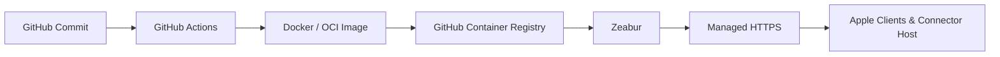

<div align="center">

# Hush

### An Always-on, Adaptive Rest Agent

**一个持续陪伴、逐渐理解你的生活节奏，并帮助你真正学会休息的环境式 Agent。**

[](apps/HushApp)
[](apps/HushApp)
[](server)
[](server)
[](#持续后台运行)
[](contracts/openapi.yaml)
[](https://github.com/Simon-byte-png/rest/actions/workflows/server-ci.yml)

[产品概览](#项目概览) · [参赛赛道](#adventurex-2026-参赛赛道) · [核心能力](#核心能力) · [系统架构](#系统架构) · [快速开始](#快速开始) · [API](#api-概览) · [项目状态](#项目状态)

</div>

---

## 项目概览

Hush 是一个面向 iOS、iPadOS 与 macOS 的**环境式休息 Agent**。

它可以在用户授权的前提下持续运行于后台，感知最少必要的工作节奏信号，增量同步授权邮箱与消息来源，整理信息、生成摘要和可编辑草稿，并在用户真正需要的时候给出一项可以立即开始的休息任务。

Hush 不只是一个“提醒你休息”的工具。它试图解决两个更深层的问题：

1. **人为什么不敢停下来？**——担心漏掉邮件、错过消息、工作还没有被妥善交接。
2. **停下来以后，怎样才算真正休息？**——刷手机不是恢复，“放松一下”也不是可执行的行动。

因此，Hush 把感知、信息交班、休息引导与长期适应连接成一个完整闭环：

```text
后台感知工作与生活节奏
→ 增量同步授权邮件和消息
→ 生成摘要、草稿与待处理线索
→ 判断当前是否适合休息
→ 提供可立即开始的动态休息任务
→ 收集轻量反馈
→ 逐渐适应用户的作息、提醒时机、任务偏好与语气
```

> **AI 不能替我们睡觉，但它可以接住那些让我们迟迟无法停下来的事情。**
>
> **AI cannot sleep for us, but it can help us feel safe enough to stop.**

Hush 不是医疗产品，不诊断疲劳、焦虑、失眠或其他疾病。它内置的是一个基础健康与休息助手：帮助用户进行低强度活动、眼部放松、姿势调整、喝水、呼吸与睡前过渡，而不是替代医生或治疗方案。

<!--
建议在项目展示前补充以下素材：

<p align="center">
  
</p>

| Always-on Companion | Dynamic Rest | Unified Inbox | Sleep Handoff |
|---|---|---|---|
|  |  |  |  |
-->

---

## AdventureX 2026 参赛赛道

Hush 选择了三个互补赛道。三条赛道不是三个彼此割裂的功能，而是从**产品价值、AI 交互和完整应用交付**三个角度解释同一个项目。

| 赛道 | 赛道关注点 | Hush 的回应 |
|---|---|---|
| **蓝盒子 · Hack the Rest** | 重新理解休息、恢复与睡眠体验 | Hush 从“不敢停下来”出发，通过 Day Reset、动态休息任务、Sleep Handoff、基础健康助手与低刺激睡前过渡，把休息从抽象建议变成可执行体验。 |
| **灵光赛道** | 全模态 AI、可交互内容与“让复杂变简单”的智能体验 | Hush 将复杂的使用节奏、邮箱负担和用户反馈，转化为自然语言陪伴、交互式休息任务、摘要、草稿和可视化状态，让 Agent 不只回答问题，而是生成此刻真正可用的体验。 |
| **百度秒哒赛道** | 用自然语言与智能体协作把想法快速变成完整应用 | Hush 是一个具备 Apple 客户端、后端服务、AI Router、Provider、OpenAPI Contract、Mock、CI 与 HTTPS 部署链路的全栈 Agent 产品，展示 AI 如何从创意进入真实可运行的软件闭环。 |

### 为什么这三个赛道适合 Hush

**蓝盒子定义了问题。** Hush 的核心不是效率提升，而是帮助人安心结束、恢复注意力，并重新学习如何休息。

**灵光强调体验。** Hush 将用户难以理解的数字节奏和信息负担，变成自然、可交互、可视化、低认知负担的 AI 体验。

**百度秒哒强调落地。** Hush 不停留在 Prompt 或 Demo 页面，而是形成客户端、Agent、Contract、后台同步、邮件草稿、测试和部署共同组成的完整产品。

> 赛道提交材料应分别突出不同叙事，但技术事实保持一致：Hush 是一个持续运行、能够适应用户、同时对隐私和外部操作保持明确边界的休息 Agent。

---

## 为什么做 Hush

我们已经拥有大量帮助人开始工作的工具：待办、日历、提醒、聊天机器人、自动化和 Copilot。

但几乎没有工具帮助人**安全地结束工作**。

传统数字健康工具通常只告诉用户“屏幕使用太久了”，甚至直接封锁应用。它们很少回答：

- 用户是在稳定推进，还是已经陷入频繁切换；
- 今天的邮件与消息是否真的还有必须处理的内容；
- 当前需要的是休息任务，还是一句不打扰的陪伴；
- 什么样的任务、时长和语气对这个用户更有效；
- 用户怎样才能把今天交给明天，而不是带着未完成感入睡。

Hush 的设计原则是：

1. **持续，但不监视**：后台只收集经过授权且完成产品功能所需的最少信息。
2. **自适应，但不黑箱**：通过结构化记忆和用户反馈调整行为，不偷偷修改规则或训练不可解释的人格。
3. **主动，但不强迫**：Agent 可以选择合适时机出现，用户始终可以开始、推迟、跳过或关闭。
4. **生成，但不越权**：AI 可以生成任务、摘要和草稿，不能直接发送邮件、控制设备或修改系统权限。
5. **真实能力与演示能力分离**：所有外部依赖均提供 Real / Mock / Unavailable 路径，Mock 永远不会被展示为 Real。
6. **先帮助用户停下来，再谈效率**：Hush 的最终目标不是让人工作更多，而是让人生活得更完整。

---

## 核心能力

### 1. 持续后台运行

Hush 的核心不是“打开一次、问一次”，而是一个可以长期存在的环境式 Agent。

不同平台使用各自合规的后台机制：

- **macOS**：菜单栏应用、Connector Host 与本地服务可持续驻留，增量记录前台使用时长、应用切换节奏和同步状态；
- **iOS / iPadOS**：通过 DeviceActivity 与系统管理的 Extension 接收使用阈值事件，而不是尝试绕过系统限制永久执行任意后台代码；
- **Backend / Connector**：在用户启用后持续进行增量同步、去重、checkpoint、摘要和草稿编排；
- **邮箱与消息**：只在明确授权的账号和 scope 内读取，支持随时断开连接。

```text
System-managed activity events
+ macOS resident companion
+ authorized inbox connectors
+ local feedback memory
             ↓
      Continuous Hush Context
```

Hush 不读取键盘输入，不录屏，不默认保存完整页面内容，也不依赖永久后台录音。

### 2. 授权邮箱与信息整理

Hush 可以在后台持续整理用户授权的邮箱和通信来源：

- 增量同步新邮件与消息事件；
- 统一不同 Provider 的字段；
- 去重并记录同步 checkpoint；
- 为每条信息生成简短摘要；
- 判断哪些内容需要用户关注；
- 生成可编辑的回复草稿；
- 在 Sleep Handoff 中汇总今晚是否还有必须处理的事项。

```text
Authorized Mail / Messages
→ Normalize
→ Deduplicate
→ Summarize
→ Draft
→ User Review
→ Explicit Confirmation
```

**Hush 不会自动发送邮件。** 所有真实发送都必须由用户查看、编辑并主动确认。

### 3. Adaptive Agent｜逐渐理解用户的日常节奏

Hush 的 Agent 是 adaptive 的。它不会永远使用同一套固定提醒，而是根据长期反馈逐步适应：

- 用户通常几点开始和结束工作；
- 哪些时段更容易出现持续使用；
- 用户接受、推迟或拒绝提醒的时间分布；
- 哪种休息时长更容易完成；
- 视觉、身体、认知或安静任务中，哪些更有效；
- 哪种语气会让用户觉得被帮助，而不是被打扰；
- 邮件和消息负担在一天中的变化；
- 用户主动设置的作息、勿扰与健康偏好。

```text
Observe minimal signals
→ Ask / receive feedback
→ Update structured Rest Memory
→ Adjust timing, frequency, task and tone
→ Continue learning
```

这里的“学习”指**可解释的结构化偏好与记忆更新**，而不是在用户不知情的情况下重新训练基础模型。用户应能够查看、修改、清除或关闭这些个性化记录。

### 4. Ambient Work Companion｜常亮工作陪伴

Hush 在 iOS 与 macOS 上提供安静的工作陪伴界面。它可以接收当前节奏的结构化摘要，并在不适合休息时返回一条简短、自然、非打断性的文案。

```text
Usage checkpoint
→ Contract 1.1 Mode A
→ should_offer_rest = false
→ 更新陪伴文案
→ 不通知、不打开任务、不强制中断
```

它不是仪表盘式地朗读指标，而是把数据转化为自然观察，例如：

> 这一段持续得有点久了。先不用马上停下，记得把肩膀松一点。

### 5. Dynamic Rest Agent｜动态休息决策

Contract 1.1 将休息 Agent 拆分为三个明确模式：

| 模式 | 作用 | 输出 |
|---|---|---|
| `work_state_or_rest_decision` | 结合当前工作节奏判断是否适合休息 | 陪伴文案，或一次性动态任务 |
| `manual_rest_quest` | 用户已经主动选择休息 | 直接生成一次性动态任务 |
| `fatigue_reflection` | 对用户自述疲劳进行非诊断性反思 | 疲劳分类、简短反思、最多一个 follow-up |

动态任务使用统一结构：

```json
{
  "title": "一分钟桌边重置",
  "duration_seconds": 60,
  "steps": [
    "暂时让双手离开键盘",
    "看向比屏幕更远的位置",
    "肩膀放松后再回来"
  ]
}
```

模型只生成受 Contract 约束的候选内容。服务端负责 Request ID、Contract Version、HTTP 状态、Actions、幂等与 Data Origin；Apple 客户端保留最终呈现和系统能力控制权。

### 6. Basic Well-being Assistant｜基础健康与休息助手

Hush 内置基础健康助手，目标是帮助用户掌握简单、低负担、日常可执行的恢复方式：

- 眼睛离开近距离屏幕；
- 站立、伸展或轻微走动；
- 放松肩颈与握持姿势；
- 喝水与短暂呼吸调整；
- 降低信息刺激；
- 睡前减少新的任务输入；
- 把明日第一步写清楚，让大脑停止反复提醒。

它不会：

- 诊断疾病或心理状态；
- 声称治疗失眠、焦虑或疼痛；
- 保证用户入睡；
- 替代专业医疗意见；
- 根据单一屏幕时间武断判断健康状况。

Hush 希望传达一个简单的理念：**休息不是效率之后的奖励，而是每个人都应该重新学会的基本能力。**

### 7. Day Reset｜日间恢复

```text
Hush Door / Background Checkpoint
→ Name the Tiredness
→ Dynamic Rest Task
→ Rest Session
→ Guided Drift 或安静
→ 双问反馈
→ 更新 Rest Memory
```

特点：

- iOS 主动入口与 macOS 菜单栏入口；
- DeviceActivity 系统检查点；
- 共享 Rest Session 状态与计时；
- 可选 Live Activity；
- Guided Drift 本地运行，不保存私人回答；
- Contract 1.0 固定内容与 Contract 1.1 动态任务并存；
- 反馈进入自适应循环，逐步调整下一次体验。

### 8. Sleep Handoff｜睡前交班

Sleep Handoff 帮助用户把未尽事项从脑海转移到一个可见、可追踪的系统中：

```text
用户准备结束今天
→ 汇总授权邮箱、消息与 Open Loops
→ 标记今晚 / 明天 / 无需处理
→ 生成可编辑草稿
→ 形成 Pause Receipt
→ 生成明日第一步
→ 进入低刺激睡前任务
```

Hush 的目标不是在睡前提供更多内容，而是减少用户继续检查信息的必要性。

> 今晚没有必须立即处理的事情。剩下的，可以交给明天醒来的你。

即使某个外部 Provider 暂时不可用，用户主动填写的 Open Loops 仍可进入交班结果；服务端会明确展示未覆盖来源，而不是伪造“全部已检查”。

### 9. Unified Inbox｜统一收件箱

Unified Inbox 将不同通信来源映射为统一的 Provider-neutral Contract：

- 飞书：`lark-cli`
- 钉钉：DingTalk `dws`
- Outlook：Microsoft Graph
- QQ 邮箱：IMAP / SMTP
- Gmail：OAuth / Mail Provider

后端支持：

- 事件批量摄取；
- 增量同步与 checkpoint；
- 消息列表与详情；
- AI 摘要；
- 回复草稿生成与编辑；
- 乐观并发版本；
- 用户确认 Token；
- 幂等发送；
- 同步状态与 Provider 可用性。

AI 只负责理解、摘要和起草。Provider 凭据、确认 Token 与发送命令始终留在受控应用层。

### 10. Sample Mode｜完整演示链路

`main` 保留可运行的 Sample Mode：

- 固定 Contract Fixtures；
- Canned Agent；
- Fixture Mail / Inbox；
- 独立 Repository 与幂等存储；
- Mock Data Origin 明确标识；
- 外部服务失败时仍能演示核心主线。

---

## 产品流程

### Always-on Adaptive Loop



### Day Reset



### Sleep Handoff



---

## 系统架构



### 分层原则

```text
api → application → domain
application → provider ports
infra/providers → provider ports
composition root → concrete implementations
```

- Route 不直接调用 AI SDK、Graph、IMAP/SMTP 或 Provider CLI；
- Domain 不依赖 Fastify 或供应商 SDK；
- Apple Feature 依赖 Core Protocol，而不是具体 Provider；
- 公共数据结构由 `contracts/` 统一定义；
- Mock、Real 与 Unavailable 图彼此隔离；
- 后台运行、同步和记忆有明确的用户授权、生命周期与可清除边界。

---

## AI、Memory 与 Contract 设计

### Adaptive 不等于无限自治

Hush 的自适应层只在允许范围内更新：

- 提醒时机；
- 提醒频率；
- 任务类型与时长偏好；
- 文案语气；
- 作息窗口；
- 用户主动设置的偏好；
- 已完成或被拒绝的休息反馈。

模型不能自行：

- 开启新的数据源；
- 扩大 OAuth scope；
- 控制通知与设备；
- 自动发送邮件；
- 改写 Contract；
- 把健康建议升级为医学结论；
- 读取没有明确授权的个人信息。

### Contract 1.0

用于旧客户端与固定内容流程：

- 固定 Quest ID；
- 固定本地内容库；
- legacy cooldown 与短模型预算；
- Guided Drift、Blue Reset 和未迁移本地流程。

### Contract 1.1

用于动态休息任务：

- Mode A：动态判断 `should_offer_rest`；
- Mode A false：返回陪伴文案，`generated_task = null`；
- Mode A true：返回一次性 `generated_task`；
- Mode B：用户已选择休息，直接返回一次性动态任务；
- 失败不降级为固定 Quest；
- `default_quest_id` 仅为兼容保留，并固定为 `null`；
- 服务端只做 JSON、字段、类型与关系校验，不把模型输出当作设备控制指令。

### StepFun Provider

```text
POST <STEPFUN_BASE_URL>/chat/completions
Authorization: Bearer <STEPFUN_API_KEY>
```

- `messages` 分离 System Prompt 与 Provider-neutral 输入；
- `response_format.type = json_object`；
- Mode Router 选择的 JSON Schema 会被序列化到模型可见的 System Message；
- 从 `choices[0].message.content` 读取结果；
- 服务端再次进行模式级结构校验；
- 测试使用 Stub，不访问真实模型网络。

---

## API 概览

完整定义以 [`contracts/openapi.yaml`](contracts/openapi.yaml) 为唯一事实源。

### Health

| Method | Endpoint | Description |
|---|---|---|
| `GET` | `/v1/health` | 轻量存活与 Provider-neutral readiness，不调用外部 Provider |

### Rest

| Method | Endpoint | Description |
|---|---|---|
| `POST` | `/v1/rest/check-in` | 疲劳反思与最多一个 follow-up |
| `POST` | `/v1/rest/evaluate` | 自动 Rest Decision；支持 Contract 1.0 / 1.1 |
| `POST` | `/v1/rest/recommend` | 主动 Rest Quest；支持 Contract 1.0 / 1.1 |
| `POST` | `/v1/rest/feedback` | 提交休息反馈并更新自适应偏好 |

### Handoff

| Method | Endpoint | Description |
|---|---|---|
| `POST` | `/v1/handoff/start` | 创建后台 Handoff Job |
| `GET` | `/v1/handoff/{jobId}` | 查询 Job 状态、摘要、草稿与结果 |
| `POST` | `/v1/handoff/{jobId}/cancel` | 取消正在运行的 Job |

### Unified Inbox

| Method | Endpoint | Description |
|---|---|---|
| `POST` | `/v1/inbox/events:batch` | Connector 批量写入增量事件 |
| `GET` | `/v1/inbox/items` | 列表、过滤与分页 |
| `GET` | `/v1/inbox/items/{itemId}` | 消息详情 |
| `POST` | `/v1/inbox/items/{itemId}/summary` | 刷新 AI 摘要 |
| `POST` | `/v1/inbox/items/{itemId}/draft` | 生成回复草稿 |
| `GET/PATCH` | `/v1/inbox/drafts/{draftId}` | 获取或编辑草稿 |
| `POST` | `/v1/inbox/drafts/{draftId}/confirmation` | 创建发送确认 |
| `POST` | `/v1/inbox/drafts/{draftId}:send` | 幂等确认发送 |
| `GET` | `/v1/inbox/sync-status` | 查询后台同步状态 |

### Provider Auth

| Method | Endpoint | Description |
|---|---|---|
| `GET/POST` | `/v1/auth/gmail/*` | Gmail OAuth、授权范围与连接管理 |

### 通用 Header

除 Health 外，业务路由通常要求：

```http
X-Request-ID: req_...
X-Client-Version: 1.0.0
X-Contract-Version: 1.0 | 1.1
```

修改型幂等接口还需要：

```http
Idempotency-Key: <stable-key>
```

服务端通过 `X-Hush-Data-Origin` 标识当前响应来自 `real`、`mock` 或成功幂等重放，避免把演示数据描述为真实数据。

---

## 技术栈

### Apple

| Layer | Technology |
|---|---|
| UI | SwiftUI |
| Platforms | iOS / iPadOS / macOS |
| Monitoring | DeviceActivity Extension |
| Resident Entry | macOS `MenuBarExtra` |
| Session Surface | Live Activity Widget |
| Architecture | Shared Core + Protocol-oriented Features |
| Local Mode | Fixture-backed Sample Mode |

### Backend

| Layer | Technology |
|---|---|
| Runtime | Node.js 20.19.x |
| Language | TypeScript 5.9 |
| Framework | Fastify 5 |
| Validation | Zod 4 + JSON Schema + AJV |
| Testing | Vitest 3 |
| Package Manager | pnpm 9.15.9 |
| API Contract | OpenAPI + JSON Schema + Fixtures |

### AI / Providers

| Capability | Adapter |
|---|---|
| Dynamic Rest Agent | StepFun Chat Completions |
| Legacy Agent / Handoff | Provider-neutral AgentLLM / Claude-compatible path |
| Gmail | Gmail OAuth / Mail Provider |
| Feishu | `lark-cli` Connector |
| DingTalk | `dws` Connector |
| Outlook | Microsoft Graph |
| QQ Mail | IMAP / SMTP |
| Offline / Demo | Fixture / Canned / Unavailable Providers |

### Infrastructure

- Docker multi-stage image；
- GitHub Actions CI；
- GitHub Container Registry；
- Zeabur-managed HTTPS staging；
- macOS Connector Host / local sidecar；
- Provider-neutral incremental sync；
- 不在仓库保存证书私钥、账户身份材料或 Secret。

---

## 项目结构

```text
rest/
├── apps/HushApp/              # iOS / macOS / Extensions / Shared SwiftUI
├── server/                    # Fastify + TypeScript backend
├── contracts/                 # OpenAPI, JSON Schema, fixtures
├── content/                   # Fixed Quest, Drift, Blue Box content
├── docs/                      # Architecture, handoff, deployment, runbooks
├── scripts/                   # Smoke, validation and integration scripts
├── .github/                   # CI, CODEOWNERS, PR templates
├── AGENTS.md                  # Coding Agent rules
└── README.md
```

关键目录：

```text
apps/HushApp/
├── Shared/Core/
├── Shared/Features/
├── Shared/DesignSystem/
├── iOSApp/
├── MacMenuBar/
├── DeviceActivityMonitorExt/
└── RestLiveActivityWidget/
```

```text
server/src/
├── api/
├── application/
├── domain/
├── agent/
├── mail/
├── messaging/
├── jobs/
├── content/
└── infra/
```

---

## 快速开始

### 1. 克隆仓库

```bash
git clone https://github.com/Simon-byte-png/rest.git
cd rest
```

### 2. 启动后端

环境要求：

- Node.js `20.19.x`
- pnpm `9.15.9`

```bash
cp .env.example .env
cd server
corepack pnpm install
corepack pnpm dev
```

默认监听：

```text
http://127.0.0.1:3000
```

健康检查：

```bash
curl http://127.0.0.1:3000/v1/health
```

### 3. 启动 Sample Mode

在 `.env` 中配置：

```dotenv
HUSH_DEMO_MODE=true
HUSH_DEMO_TOKEN=<your-local-demo-token>
HUSH_REST_DECISION_PROVIDER=canned
```

Sample Mode 使用独立的 Fixture / Canned 图，不会调用真实 StepFun、Gmail 或 Unified Inbox Provider。

### 4. 配置 StepFun Dynamic Rest Agent

```dotenv
HUSH_REST_DECISION_PROVIDER=real
STEPFUN_API_KEY=<secret>
STEPFUN_BASE_URL=https://api.stepfun.com/v1
STEPFUN_MODEL=<account-enabled-model>
STEPFUN_TIMEOUT_MS=30000
```

密钥只应写入本地 `.env` 或部署平台 Secret Manager，不得提交到 Git。

### 5. 配置后台同步

根据所启用的 Provider 配置 Connector Token、OAuth 或应用凭据。后台 Connector 只应申请产品功能所需的最小 scope，并允许用户随时暂停同步或撤销授权。

```dotenv
HUSH_APP_TOKEN=<local-app-token>
HUSH_CONNECTOR_TOKEN=<connector-token>
```

### 6. 打开 Apple 工程

需要 macOS 与 Xcode：

```bash
open apps/HushApp/Hush.xcodeproj
```

主要 Scheme：

- `Hush`
- `HushMac`
- `HushDeviceActivityMonitor`

命令行构建示例：

```bash
xcodebuild \
  -project apps/HushApp/Hush.xcodeproj \
  -scheme Hush \
  -configuration Debug \
  -destination 'generic/platform=iOS Simulator' \
  build

xcodebuild \
  -project apps/HushApp/Hush.xcodeproj \
  -scheme HushMac \
  -configuration Debug \
  build
```

---

## 常用环境变量

| Variable | Purpose |
|---|---|
| `HOST` / `PORT` | 后端监听地址与端口 |
| `PUBLIC_BASE_URL` | 公共 HTTPS Origin / 回调基础地址 |
| `HUSH_DEMO_MODE` | 开启 Sample Mode |
| `HUSH_DEMO_TOKEN` | Demo 图访问令牌 |
| `HUSH_REST_DECISION_PROVIDER` | `real` / `canned` / `unavailable` |
| `STEPFUN_API_KEY` | StepFun Secret |
| `STEPFUN_BASE_URL` | StepFun API Base URL |
| `STEPFUN_MODEL` | 账户实际可用模型 |
| `STEPFUN_TIMEOUT_MS` | Dynamic Rest transport timeout |
| `CLAUDE_API_KEY` / `CLAUDE_MODEL` | Legacy / Handoff Agent 配置 |
| `HUSH_APP_TOKEN` | Unified Inbox App API Token |
| `HUSH_CONNECTOR_TOKEN` | Connector Host 摄取 Token |

完整配置与部署边界见 [`server/README.md`](server/README.md) 与 [`docs/18_ZEABUR_STAGING_DEPLOYMENT.md`](docs/18_ZEABUR_STAGING_DEPLOYMENT.md)。

---

## 测试

后端所有普通测试均为确定性测试，不访问真实 StepFun 或真实第三方账号。

```bash
cd server

corepack pnpm typecheck
corepack pnpm test:contracts
corepack pnpm test:providers
corepack pnpm test:integration
corepack pnpm test:vertical
corepack pnpm test
corepack pnpm build
corepack pnpm check
```

Contract 1.1 动态任务 Smoke：

```powershell
.\scripts\smoke-dynamic-rest-decision.ps1 `
  -BaseUrl "http://127.0.0.1:3000" `
  -ExpectedDataOrigin mock `
  -FixtureMode All
```

测试原则：

- 成功与失败路径同时覆盖；
- Contract Fixtures 必须通过 JSON Schema；
- OpenAPI、Zod 与 Swift Codable 保持镜像；
- Mock 不得标记为 Real；
- Secret、Authorization 与私密正文不得出现在日志或错误响应中；
- Contract 变更必须通过独立 Contract Change。

---

## 部署



HTTPS Staging：

```text
https://hush-server-staging.preview.aliyun-zeabur.cn
```

部署时必须通过平台 Secret Manager 注入 Provider 密钥。`GET /v1/health` 不调用外部 Provider，也不会公开模型名、完整 Base URL、API Key 或上游错误正文。

---

## 安全、隐私与控制边界

### 所有持续收集都必须经过授权

Hush 的后台能力不等于无限收集：

- 用户必须主动连接邮箱或通信 Provider；
- Connector 使用最小权限 scope；
- 用户可以暂停同步、断开账号和清除本地记忆；
- 默认不记录完整私密正文到普通日志；
- 不读取键盘输入、麦克风常驻录音或屏幕像素；
- 使用节奏与邮件内容使用不同的数据边界和存储策略。

### Apple 客户端拥有最终控制权

后端不能直接：

- 开始或结束用户休息；
- 屏蔽 App 或网站；
- 修改 DeviceActivity checkpoint；
- 触发 Shield / Lockdown；
- 自动发送 Gmail 或其他外部消息；
- 保存 Guided Drift 回答；
- 对用户进行医学诊断。

### 用户拥有最终发送权

Unified Inbox 的发送流程必须经过：

```text
Draft Version
→ Confirmation Token
→ App Session Binding
→ Idempotency Key
→ Provider Send
```

模型看不到 Provider Secret、Confirmation Token，也没有 Send Tool。

### 数据来源明确

- `real`：所有参与依赖均为真实 Provider；
- `mock`：Fixture、Canned、Recording、Noop 等任何演示依赖参与；
- Provider 失败不会被伪装为成功；
- 成功幂等重放不会重新执行外部副作用。

### 隐私最小化

普通日志只记录 Request ID、模式、状态、耗时、来源、上下文数量和错误类别；不记录完整消息正文、用户回答、草稿正文、Authorization、API Key 或私密模型输入输出。

---

## 项目状态

Hush 当前是一个**可运行、可演示、具备真实 Provider 接口与完整 Contract 的工程原型**。部分真实账号、Apple 真机和生产合规能力仍需要持续验收。

| Capability | Code / Contract | Sample Mode | Real Environment Validation |
|---|:---:|:---:|:---:|
| iOS / macOS 主动休息体验 | ✅ | ✅ | 需 Apple 构建与真机矩阵持续验证 |
| macOS 常驻后台入口 | ✅ | ✅ | 需长期运行与权限矩阵验证 |
| DeviceActivity 系统检查点 | ✅ | ✅ | 需不同设备与系统版本验证 |
| Adaptive Rest Memory | ✅ / 可扩展 | ✅ | 需长期用户反馈验证 |
| Contract 1.1 Dynamic Rest | ✅ | ✅ | 需账户模型与 Staging 验证 |
| StepFun Adapter | ✅ | Stub / Canned | 需真实账户权限 |
| 基础健康与休息助手 | ✅ | ✅ | 非医疗；需内容持续审查 |
| HTTPS Staging | ✅ | ✅ | 已部署并完成基础 HTTPS Smoke |
| Handoff Job / Pause Receipt | ✅ | ✅ | Gmail 账号授权与真实草稿需环境验证 |
| Unified Inbox Backend | ✅ | ✅ | 各渠道需要租户 / Token / 授权码验证 |
| 后台增量同步 | ✅ / Connector | ✅ | 需多账号和长时间运行验证 |
| Unified Inbox Apple UI | Fixture UI | ✅ | API-connected Apple build 待完成 |
| Durable Production Storage | Port Ready | In-memory | 待数据库与多实例协调 |

---

## 文档索引

| Document | Purpose |
|---|---|
| [`docs/00_PROTOCOL_INDEX.md`](docs/00_PROTOCOL_INDEX.md) | 协议总览与优先级 |
| [`docs/01_SCOPE_AND_FEATURE_FLOWS.md`](docs/01_SCOPE_AND_FEATURE_FLOWS.md) | 产品范围与核心流程 |
| [`docs/02_SYSTEM_BOUNDARIES_AND_INTERFACES.md`](docs/02_SYSTEM_BOUNDARIES_AND_INTERFACES.md) | 系统边界与接口职责 |
| [`docs/03_RUNTIME_AND_FAILURE_PROTOCOL.md`](docs/03_RUNTIME_AND_FAILURE_PROTOCOL.md) | 超时、重试、幂等、降级 |
| [`docs/07_PROJECT_STRUCTURE.md`](docs/07_PROJECT_STRUCTURE.md) | 项目结构与模块职责 |
| [`docs/08_DEFINITION_OF_DONE_AND_TESTING.md`](docs/08_DEFINITION_OF_DONE_AND_TESTING.md) | Definition of Done 与测试协议 |
| [`docs/13_PROVIDER_INTEGRATION_KIT.md`](docs/13_PROVIDER_INTEGRATION_KIT.md) | Provider 接入边界 |
| [`docs/17_APPLE_REST_DECISION_HANDOFF.md`](docs/17_APPLE_REST_DECISION_HANDOFF.md) | Apple Rest Decision 联调 |
| [`docs/18_ZEABUR_STAGING_DEPLOYMENT.md`](docs/18_ZEABUR_STAGING_DEPLOYMENT.md) | HTTPS Staging 部署 |
| [`docs/19_REAL_REST_DECISION_AGENT.md`](docs/19_REAL_REST_DECISION_AGENT.md) | Legacy Real Rest Decision |
| [`docs/21_UNIFIED_INBOX_CONTRACT_AND_SWIFT_MAPPING.md`](docs/21_UNIFIED_INBOX_CONTRACT_AND_SWIFT_MAPPING.md) | Unified Inbox Contract 与 Swift 映射 |
| [`docs/22_DYNAMIC_REST_TASK_CONTRACT_1_1.md`](docs/22_DYNAMIC_REST_TASK_CONTRACT_1_1.md) | StepFun Dynamic Rest Contract 1.1 |
| [`contracts/openapi.yaml`](contracts/openapi.yaml) | HTTP API 唯一事实源 |

---

## 团队协作

Hush 采用明确的目录所有权与 Contract-first 协作方式：

| Role | Responsibility |
|---|---|
| M1 / P1 | Apple 平台、Xcode、共享核心、平台适配与最终集成 |
| M2 / P4 | SwiftUI 产品界面、Design System、Rest 内容与 Demo |
| W1 / P2 | Rest / Handoff 后端、Agent、Contract、Composition Root |
| W2 / P3 | Unified Inbox、Connector Host、四渠道 Provider 与发送链路 |

核心协作原则：

- 公共 Contract 有唯一 Owner；
- 每个外部依赖都必须有 Real + Mock / Unavailable；
- 客户端可先使用 Fixture，不等待真实后端；
- `main` 始终保持 Sample Mode 可运行；
- 跨模块变更必须通过 Contract Change 与对应 Reviewer。

---

## Roadmap

- [ ] 完成 Apple API-connected Unified Inbox UI；
- [ ] 完成 StepFun 真实账户与多模式 Staging 验证；
- [ ] 完成 Gmail 与各渠道 Connector 的账号级验收；
- [ ] 强化 Adaptive Rest Memory 的可视化、编辑、导出与清除能力；
- [ ] 将进程内 Repository / Idempotency Store 替换为持久化实现；
- [ ] 增加多实例协调、队列与可观测性；
- [ ] 完成长时间后台运行、断网恢复和同步 checkpoint 压力测试；
- [ ] 完成 Apple 真机通知、App Group、Live Activity 与恢复矩阵；
- [ ] 完善 Sleep Handoff 专用 Agent 与次日晨间摘要；
- [ ] 补充项目展示截图、演示视频与公开 Demo 指引。

---

## 项目来源

Hush 最初为 AdventureX 2026 黑客松项目，参赛方向包括：

- 蓝盒子 · Hack the Rest；
- 灵光赛道；
- 百度秒哒赛道。

项目在短周期协作中采用 Contract-first、Provider abstraction、Sample Mode、后台增量同步与多人目录所有权，尝试证明：

> 一个真正有用的 Agent，不应该只在用户提问时回答。它可以长期陪伴、理解节奏、接住信息，并在合适的时刻提醒我们——现在可以停一下了。

---

<div align="center">

**Hush is not here to push you harder.**  
**It is here to help you rest better, live more gently, and leave a little space.**

</div>
